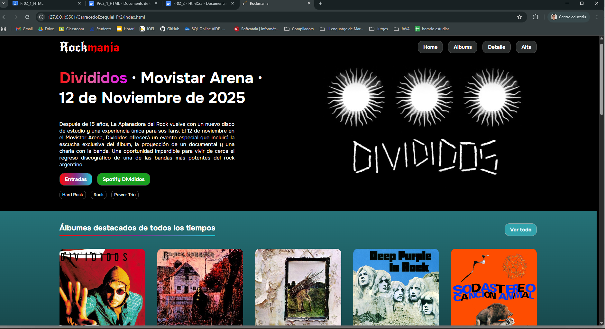
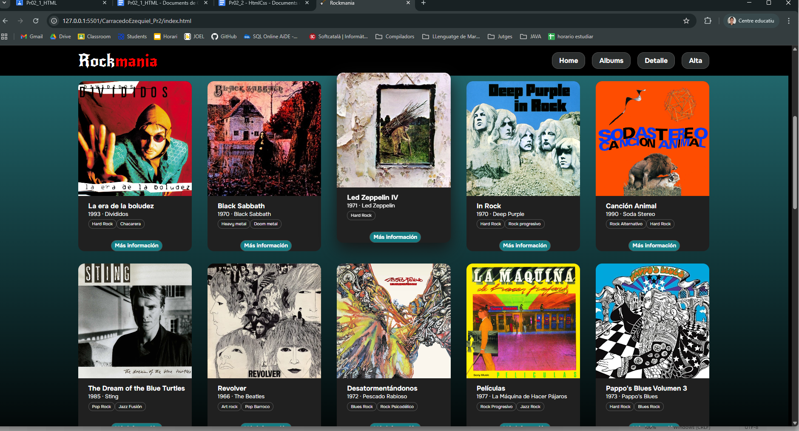
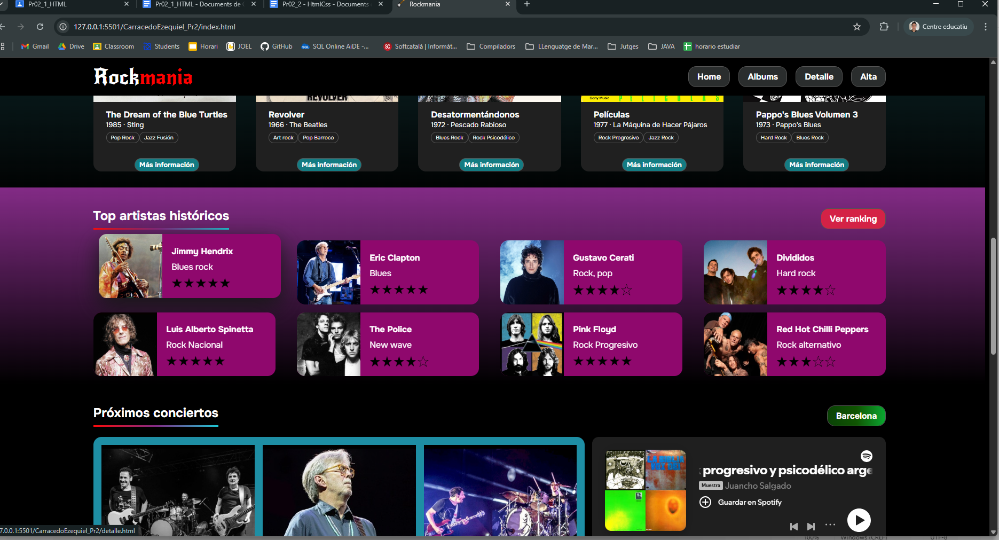
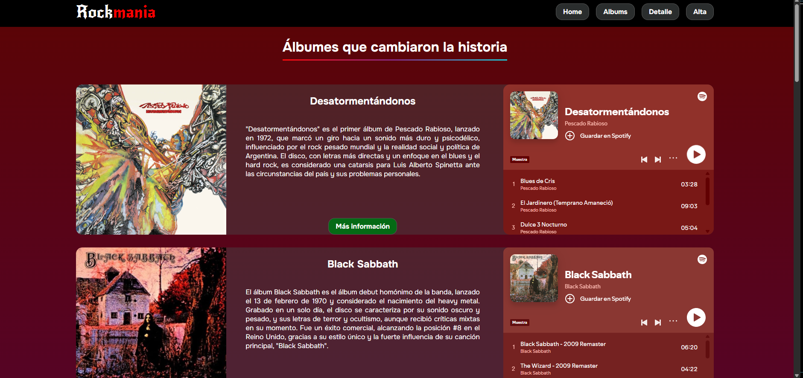
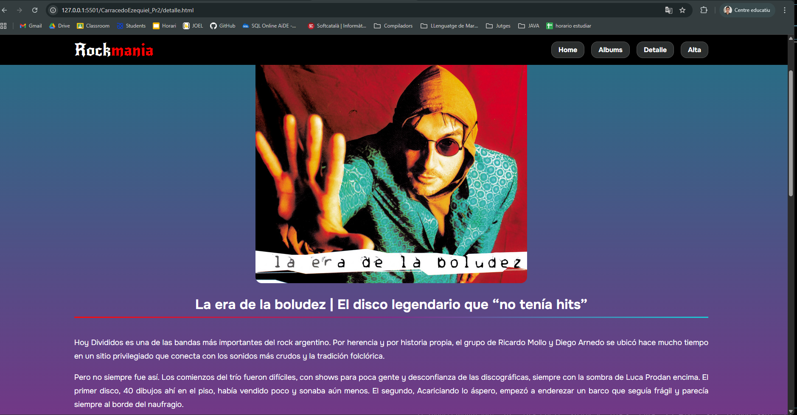
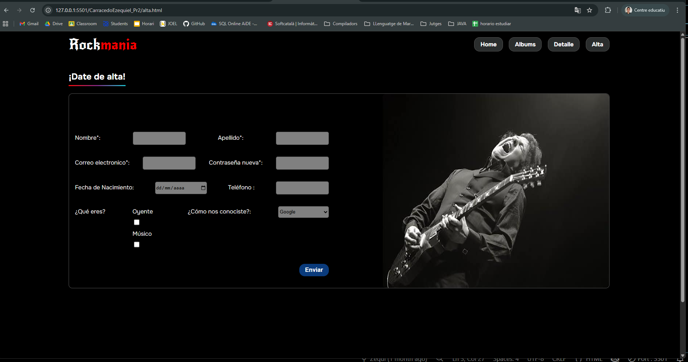

## Capturas

### <u>Home</u>

En el Home he intentado seguir el estilo general del ejemplo dado. Luego, en el final del proyecto, revisando detalles, logré hacer que las tarjetas de los álbumes y los artistas se muevan al pasar el puntero por ellos. 

También logré que el enlace a detalle de los artistas sea toda la tarjeta entera.

### <u>Álbumes</u>

Para este listado, me interesaba incorporar el reproductor de Spotify dentro de la tarjeta. Hice tarjetas grandes y vistosas con un fondo con transparencia. 

### <u>Detalle</u>

Para el detalle, priorice una estética simple y poco cargada de elementos. Dándole prioridad al texto.

### <u>Alta</u>

## Retrospectiva 

He hecho un portal web dedicado a la música rock, siguiendo el estilo sugerido por el ejemplo que se nos dio.

Al principio me costó mucho entender el funcionamiento del CSS con tantos elementos en juego. Dediqué muchas horas y mi avance fue muy lento, finalmente, en el último periodo de tiempo (última semana antes de la entrega aproximadamente), comencé a tener mejoras en lograr los resultados que buscaba y ganar agilidad a la hora de entender y saber cómo se comportan los elementos. Todo esto fue posible gracias a muchas horas dedicadas y a escuchar los consejos de Alicia. Una vez que ya tenía conocimientos más claros sobre cómo funciona, hice un repaso por la página principal (que ya la tenía hecha), reformulando, mejorando y arreglando cosas para darle un aspecto más parecido a la idea que tenía originalmente. 

Fue un proceso un poco frustrante, pero muy satisfactorio finalmente, ya que hacia el final, pude entender mucho mejor y pude evidenciar cambios muy grandes entre mis conocimientos al comenzar y al acabar el proyecto.